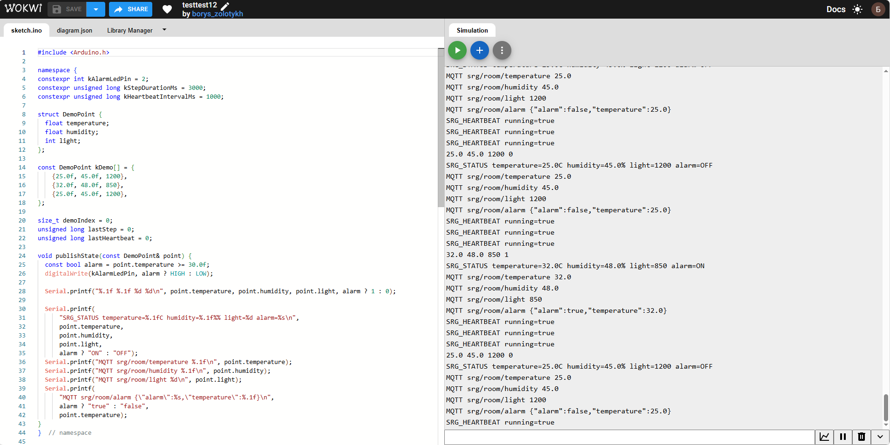

# Wokwi Model

## Public link

[Open the published Smart Room Guardian model in Wokwi](https://wokwi.com/projects/475886296569145345)

## Evidence screenshot

Add the screenshot captured while the Serial Monitor and red alarm LED show the high-temperature scenario:

`wokwi_alarm_scenario.png`

Expected sequence:

`safe -> alarm -> safe`

1. `temperature=25.0C alarm=OFF`
2. `temperature=32.0C alarm=ON`
3. `temperature=25.0C alarm=OFF`

## Local model

The reproducible local model is in [`wokwi/`](wokwi/). Open `diagram.json` in a new Wokwi ESP32 project, add the firmware source, and run the simulation. The firmware uses a deterministic serial demonstration mode so the key alarm behavior can be shown reliably.
